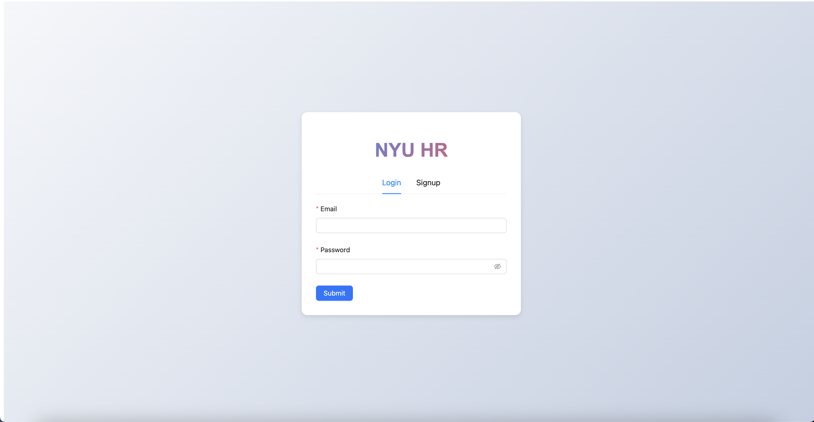
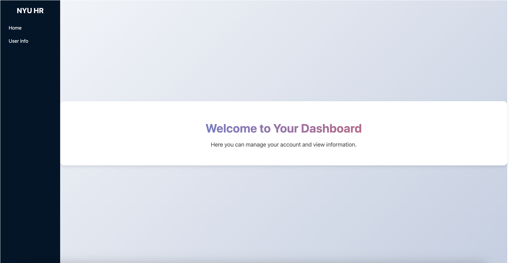
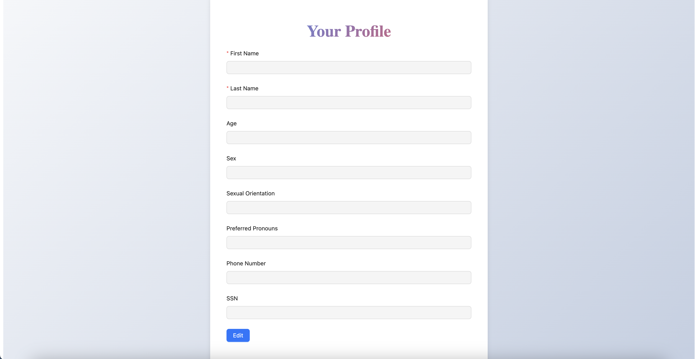
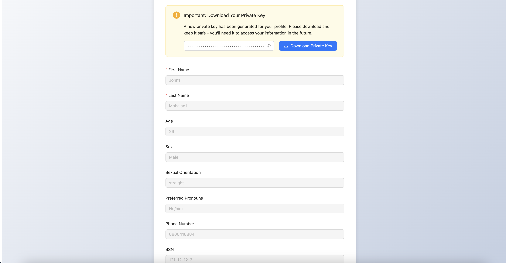

# Post-Quantum Safe PKI Demonstration

This project implements quantum-safe cryptography using liboqs, providing secure encryption for sensitive HR data with post-quantum security guarantees.

## Features

- Quantum-safe encryption using Kyber1024 KEM
- Secure handling of employee PII data
- Full-stack implementation with React frontend and FastAPI backend

## Project Structure

```
.
├── hr_portal_frontend/    # Vite React TypeScript frontend
├── hr_portal_backend/     # FastAPI backend with Poetry
├── encrypt.py
├── decrypt.py
├── setup.py
└── cleanup.py
```

## Prerequisites

- liboqs-python wrapper
- Python packages: oqs, cryptography
- Node.js and npm/yarn for frontend
- Poetry for backend dependency management

## Backend Setup

### Install liboqs-python (path from root)

```bash
# Clone and install liboqs-python
cd hr_portal_backend/hr_portal_backend
git clone --depth=1 https://github.com/open-quantum-safe/liboqs-python
cd liboqs-python
pip install .
```

If liboqs is not already installed on your system, the wrapper will automatically download, configure, and install it during the first runtime.

### Setup Backend Application (path from root)

```bash
cd hr_portal_backend/hr_portal_backend
poetry install
poetry run uvicorn main:app --reload
```

For Unix-like systems, you may need to set the library path:

```bash
export LD_LIBRARY_PATH=$LD_LIBRARY_PATH:/usr/local/lib
```

For macOS users, use:

```bash
export DYLD_LIBRARY_PATH=$DYLD_LIBRARY_PATH:/usr/local/lib
```

### System Dependencies

For Ubuntu systems:

```bash
sudo apt install astyle cmake gcc ninja-build libssl-dev python3-pytest python3-pytest-xdist unzip xsltproc doxygen graphviz python3-yaml valgrind
```

For macOS using Homebrew:

```bash
brew install cmake ninja openssl@3 wget doxygen graphviz astyle valgrind
pip3 install pytest pytest-xdist pyyaml
```

## Frontend Setup

```bash
cd hr_portal_frontend
npm install
npm run dev
```

## API Documentation

### Authentication Endpoints

```python
POST /signup
Request:
{
    "email": str,
    "password": str
}
Response:
{
    "id": int,
    "email": str
}

POST /login
Request:
{
    "email": str,
    "password": str
}
Response:
{
    "access_token": str,
    "token_type": "bearer"
}
```

### User Information Endpoints

```python
GET /me
Response:
{
    "id": int,
    "email": str
}

PUT /me/info
Request:
{
    "first_name": str | null,
    "last_name": str | null,
    "age": int | null,
    "sex": str | null,
    "sexual_orientation": str | null,
    "preferred_pronouns": str | null,
    "phone_number": str | null,
    "ssn": str | null
}
Response:
{
    "message": str,
    "private_key": str
}

POST /me/info/decrypt
Request:
{
    "private_key": str
}
Response: {
    // Decrypted user information
}

GET /me/info/status
Response:
{
    "has_info": bool,
    "user_id": int,
    "email": str
}
```

### Authentication

All endpoints except `/signup` and `/login` require Bearer token authentication:

```python
Headers:
{
    "Authorization": "Bearer {access_token}"
}
```

### Error Responses

```python
401 Unauthorized:
{
    "detail": "Invalid token"
}

400 Bad Request:
{
    "detail": "Email already registered"
}

404 Not Found:
{
    "detail": "User not found"
}
```

### CORS Configuration

The API allows:
- All origins (*)
- All methods
- All headers
- Credentials

### Data Models

**LoginRequest**
```python
{
    "email": str
    "password": str
}
```

**UserInfoRequest**
```python
{
    "first_name": Optional[str]
    "last_name": Optional[str]
    "age": Optional[int]
    "sex": Optional[str]
    "sexual_orientation": Optional[str]
    "preferred_pronouns": Optional[str]
    "phone_number": Optional[str]
    "ssn": Optional[str]
}
```

**DecryptRequest**
```python
{
    "private_key": str
}
```

## Cryptographic Operations
#### (Can be run without running the frontend and backend just to check the encryption/decryption)

### Initial Setup

```bash
python3 setup.py
```

This command initializes the workspace and generates quantum-safe public/private keypairs.

### File Encryption

```bash
python3 encrypt.py {plaintext file}
```

Encrypts the input file using Kyber1024 KEM for key exchange and AES-256 for data encryption.

### File Decryption

```bash
python3 decrypt.py
```

Decrypts the encrypted file using the stored keys.

### Cleanup

```bash
python3 cleanup.py
```

Removes all generated keys, secrets, and encrypted/decrypted files.

## Development

### Frontend Development
- Located in `hr_portal_frontend/`
- Built with Vite, React, and TypeScript
- Run development server: `npm run dev`
- Build production: `npm run build`

### Backend Development
- Located in `hr_portal_backend/hr_portal_backend`
- FastAPI application with Poetry dependency management
- Install dependencies: `poetry install`
- Enter the poetry shell: `poetry shelll`
- Run development server: `uvicorn hr_portal_backend.app:app --reload`


## Security Notes

- All cryptographic operations use quantum-safe algorithms from liboqs
- Employee PII data is protected using post-quantum cryptography
- Keys and secrets are automatically managed and cleaned up
- The system uses a common API for post-quantum algorithms, making it easy to switch between different quantum-safe schemes

## Application Screenshots

<p>Login/Signup Page:</p>
<div align="center">

</div>

<p>Dashboard Page:</p>
<div align="center">

</div>

<p>User Information Page (when user has no information in the database):</p>
<div align="center">

</div>

<p>User Information Page prompting user to give the private key to view the data (when user has information in the database):</p>
<div align="center">

</div>

<p>User Information Page showing user info after successful decryption (when user has information in the database):</p>
<div align="center">

</div>


## Contributing

1. Fork the repository
2. Create your feature branch
3. Commit your changes
4. Push to the branch
5. Create a new Pull Request

## License

This project is licensed under the MIT License.